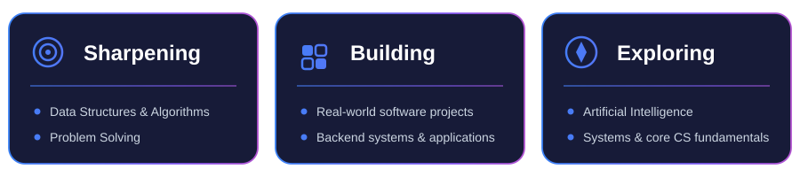
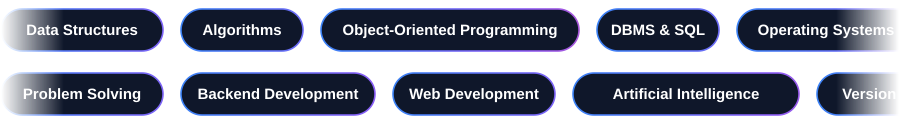
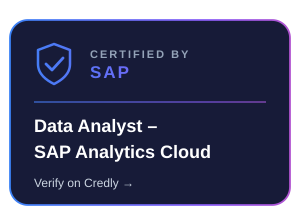
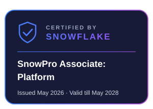

<!-- ============================================================
     ARNAOV GARG — GitHub Profile README
     Works on both light and dark GitHub themes.
     Needs the /assets folder from this kit in the same repo.
     ============================================================ -->

<!-- ───────────── ANIMATED HEADER ───────────── -->

<!-- Typing animation (color adapts to light / dark theme) -->
<a href="https://github.com/ArnaovGarg925">
  <picture>
    <source media="(prefers-color-scheme: dark)" srcset="https://readme-typing-svg.demolab.com?font=Fira+Code&weight=600&size=22&duration=3000&pause=1000&color=A78BFA&center=true&vCenter=true&width=720&height=50&lines=Builder+%E2%80%A2+Problem+Solver+%E2%80%A2+CSE+Undergrad;B.Tech+CSE+Core+%E2%80%A2+3rd+Year;Backend+%E2%80%A2+Systems+%E2%80%A2+AI;Turning+ideas+into+working+software" />
    
  </picture>
</a>

  

  

&nbsp;&nbsp;

  

  

<!-- ───────────── ABOUT ───────────── -->

  I'm <b>Arnaov Garg</b>, a third-year B.Tech Computer Science (Core) student focused on <b>building real software</b>. 
  This is the stage where learning turns into shipping — I take ideas from problem statement to working product, 
  and sharpen my problem-solving with Data Structures &amp; Algorithms along the way.

  I'm looking for a software development internship where I can contribute to real products, 
  learn from experienced engineers.

<table>
  <tr>
    <td>🎓 <b>Education</b></td>
    <td>B.Tech in Computer Science &amp; Engineering (Core) — 3rd Year</td>
  </tr>
  <tr>
    <td>🛠️ <b>Focus</b></td>
    <td>Software Development· Algorithms · Systems · AI</td>
  </tr>
  <tr>
    <td>🚀 <b>Currently</b></td>
    <td>Building real-world software and shipping projects</td>
  </tr>
  <tr>
    <td>📜 <b>Certified</b></td>
    <td>Microsoft · SAP · Snowflake</td>
  </tr>
  <tr>
    <td>🎯 <b>Seeking</b></td>
    <td>Software Development Internships (SDE)</td>
  </tr>
  <tr>
    <td>⚡ <b>Approach</b></td>
    <td>Build first, talk later.</td>
  </tr>
</table>

 

  

<!-- ───────────── TECH STACK ───────────── -->

 

<b>Languages</b> 

  
<b>Web &amp; Backend</b> 

  
<b>Database &amp; Tools</b> 

  

  

<!-- ============================================================
     PROJECTS SECTION — add back when your new projects are ready.
     Remove these comment markers and fill in your details.

<h2>🚀 Featured Projects</h2>

<table>
  <tr>
    <td width="50%" valign="top">
      <h3>🔥 <a href="https://github.com/ArnaovGarg925/REPO-NAME">Project Name</a></h3>
      
One line on what it does and why it matters.

      
    </td>
    <td width="50%" valign="top">
      <h3>⚡ <a href="https://github.com/ArnaovGarg925/REPO-NAME">Project Name</a></h3>
      
One line on what it does and why it matters.

      
    </td>
  </tr>
</table>
     ============================================================ -->

<!-- ───────────── FOCUS ───────────── -->

 

 

  

<!-- ───────────── ACTIVITY (snake) ───────────── -->

 

<picture>
  <source media="(prefers-color-scheme: dark)" srcset="https://raw.githubusercontent.com/ArnaovGarg925/ArnaovGarg925/output/github-contribution-grid-snake-dark.svg" />
  <source media="(prefers-color-scheme: light)" srcset="https://raw.githubusercontent.com/ArnaovGarg925/ArnaovGarg925/output/github-contribution-grid-snake.svg" />
  
</picture>

  

  

<!-- ───────────── CORE CS TOOLKIT ───────────── -->

 

 

  

<!-- ───────────── HOW I BUILD ───────────── -->

 

 

  

<!-- ───────────── CERTIFICATIONS ───────────── -->

 

 

  

<!-- ============================================================
     ACHIEVEMENTS — add when you have them (certificates, hackathons, courses...)

<h2>🏆 Achievements</h2>

• Your first achievement here

     ============================================================ -->

<!-- ───────────── MINDSET ───────────── -->

 

 

  

<!-- ───────────── CONNECT ───────────── -->

 

<b>Open to:</b> 
💼 Software Development Internships &nbsp;·&nbsp; 🖥️ Full-Stack Development &nbsp;·&nbsp; 🤝 Collaboration &amp; Open Source

  

&nbsp;&nbsp;

  

📧 arnaovgarg@gmail.com

